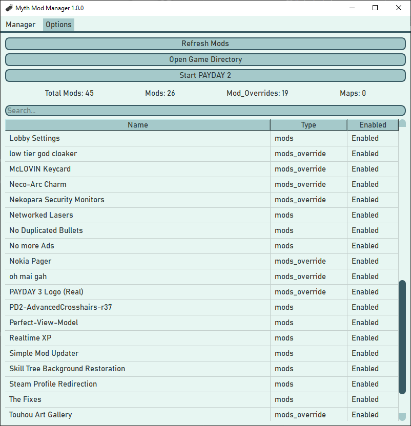

# Myth Mod Manager

A simple mod manager for PAYDAY 2 to make managing all of those files a little bit easier.

# Features

* Disable mods you don't want to use at the moment.
    + *This feature is good for testing out which mod is crashing the game!*

* External tools tab to have shortcuts to modding tools in one place

* Search bar to find the installed mod you're looking for in seconds.

* Create profiles to organize your mods.

* Assign tags to mods

* Delete mods from your computer.

* Automatic installation by dragging and dropping files into the program.
    + This also includes automatic unzipping.

    + *You still have to choose what type of mod it is (mods, mod_overrides, maps)*

* Easy to access buttons for your game directory, crash logs, and starting the game.

* Backup all of your mods and package it into a compressed file.
  
* Auto detects and installs Myth Mod Manager's updates.

**Like all PAYDAY 2 Mods, [Super BLT](https://superblt.znix.xyz/) is required to run mods**

# Showcase

 

# Anti-Virus False Positives (And building the exe yourself)

There have been multiple reports from users that anti virus programs believe the program contains
a trojan.

[This issue is being worked on](https://github.com/Wolfmyths/Myth-Mod-Manager/issues/22)

Rest assured, this program does not contain malicious code.

**When a release is published, github builds the executable as seen [here](https://github.com/Wolfmyths/Myth-Mod-Manager/blob/main/.github/workflows), not me.**

If you still are suspicious, you can build the executable yourself with these steps:

1. [Install Python 3.11](https://www.python.org/downloads/)
2. Clone this repository
3. Run `createEXE.bat` or `createEXE.sh` depending on your OS
4. There will be a folder created called `Myth Mod Manager` which contains the newly compiled executable. This is created within the repository.
5. Move `Myth Mod Manager` to your preferred directory and start it.

# Supported Platforms

### Reguarding OS

Windows:

+ It is recommended to use windows 10 or higher
+ Windows 7 is not supported

Linux/MacOS:

Linux is supported, but I've only tested on Mint Linux.

Please report any issues found.

### Reguarding Storefront

It works with both steam and epic games versions.

# Download
You may download any version of Myth Mod Manager and view changelogs at the [releases page](https://github.com/Wolfmyths/Myth-Mod-Manager/releases)

# Future Plans

+ New Icon/Logo
+ Auto mod type detection
+ Multi-Language Support [See issue #44](https://github.com/Wolfmyths/Myth-Mod-Manager/issues/44)
+ Some kind of [modworkshop.net](https://modworkshop.net/g/payday-2) integration, see [issue #14](https://github.com/Wolfmyths/Myth-Mod-Manager/issues/14)

*Suggestions are appreciated!*
