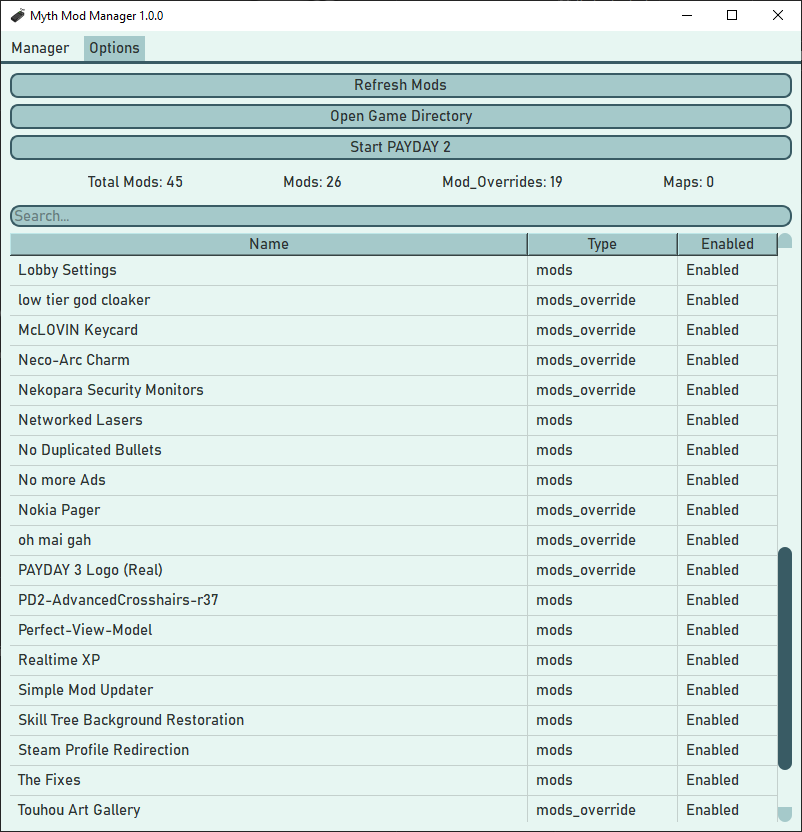

# Myth Mod Manager

A simple mod manager for PAYDAY 2 to make managing all of those files a little bit easier.

# Features

* Disable mods you don't want to use at the moment.
    + *This feature is good for testing out which mod is crashing the game!*

* External tools tab to have shortcuts to modding tools in one place

* Search bar to find the installed mod you're looking for in seconds.

* Create profiles and use tags to organize your mods.

* Delete mods from your computer.

* Automatic installation by dragging and dropping files into the program.
    + This also includes automatic unzipping.

    + *You still have to choose what type of mod it is (mods, mod_overrides, maps)*

* Easy to access buttons for your game directory, crash logs, and starting the game.

* Backup all of your mods into a compressed file.
  
* Checks for Myth Mod Manager updates and can install them.
  
* Configure PAYDAY 2 launch parameters

**Myth Mod Manger runs under the assumption you have [Super BLT](https://superblt.znix.xyz/) installed**

**Myth Mod Manager is an external program and does not directly mod PAYDAY 2**

# Showcase

 

# Anti-Virus False Positives (And building the exe yourself)

Rest assured, this program does not contain malicious code. The program is compressed with [upx](https://upx.github.io/) which commonly raises flase positives.

**When a release is published, github builds the executable as seen [here](https://github.com/Wolfmyths/Myth-Mod-Manager/blob/main/.github/workflows), not me.**

If you still are suspicious, you can build the executable yourself with these steps:

1. [Install Python 3.11](https://www.python.org/downloads/)
2. Clone this repository
3. (Optional but recommended) Create and run a virtual environment with `venv.bat` or `venv.sh` depending on your OS
4. Run `createEXE.bat` or `createEXE.sh` depending on your OS (Make sure cwd is the project folder, not the venv)
5. There will be a folder created called `Myth Mod Manager` which contains the newly compiled executable. This is created within the repository.
6. Move `Myth Mod Manager` to your preferred directory and start it.

# Supported Platforms

### Regarding OS

Windows:

+ It is recommended to use windows 10 or higher
+ Windows 7 is not supported

Linux/MacOS:

Linux is supported, but I've only tested on Mint Linux.

Please report any issues found.

### Reguarding Storefront

It works with both steam and epic games versions.

# Supported Languages

The following languages are supported but may not be accurate.
If you want to help contribute support for a language, [See issue #44](https://github.com/Wolfmyths/Myth-Mod-Manager/issues/44) or read CONTRIBUTING.md and make a contribution.

Deutsch, English, Español (españa), Français, Italiano, 日本語, 한국인, Nederlands, Polski Português (Brasil), Русский, 中文（简体）

# Download
You may download any version of Myth Mod Manager and view changelogs at the [releases page](https://github.com/Wolfmyths/Myth-Mod-Manager/releases)

# Future Plans

+ New Icon/Logo
+ Auto mod type detection
+ Improve Multi-Language Support [See issue #44](https://github.com/Wolfmyths/Myth-Mod-Manager/issues/44)
+ Some kind of [modworkshop.net](https://modworkshop.net/g/payday-2) integration, see [issue #14](https://github.com/Wolfmyths/Myth-Mod-Manager/issues/14)

*Suggestions are appreciated!*
